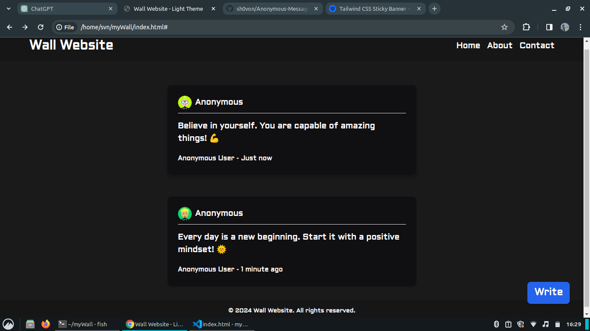

# Anonymous Message Wall - Dark Theme

This repository contains the code for the Anonymous Message Wall, a dark-themed user interface for a website where users can post anonymous messages to a public wall. The UI is built using HTML, CSS, and the Tailwind CSS framework. 

## Preview

## Features

- Responsive design suitable for various screen sizes.
- Sticky header with navigation menu.
- Mobile-friendly hamburger menu for small screens.
- Note cards displaying anonymous user-generated messages.
- Modal for writing new anonymous messages.
- Custom styling using Tailwind CSS.
- Dark theme with subtle shadow effects.

## Usage

Simply open the `index.html` file in your web browser to view the UI.

## Contributing

Contributions are welcome! If you have any suggestions, bug reports, or feature requests, please [open an issue](https://github.com/your-username/anonymous-message-wall/issues) or [create a pull request](https://github.com/your-username/anonymous-message-wall/pulls).

## License

This project is licensed under the [MIT License](LICENSE).
